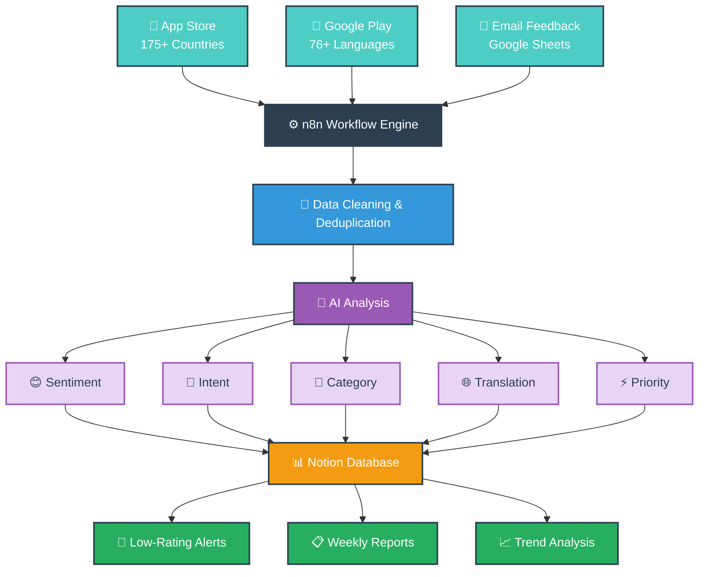
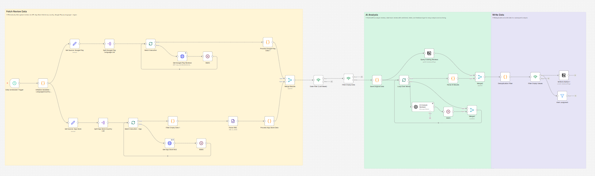
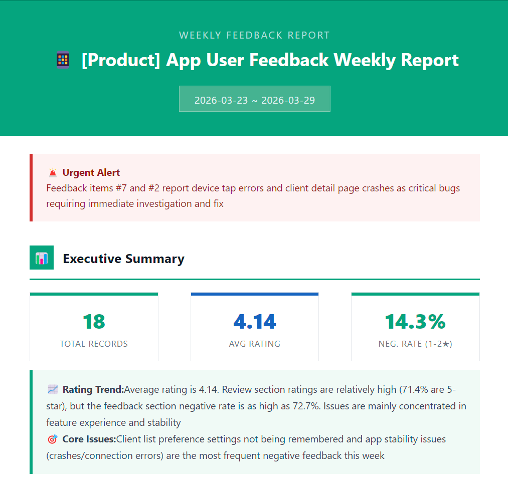
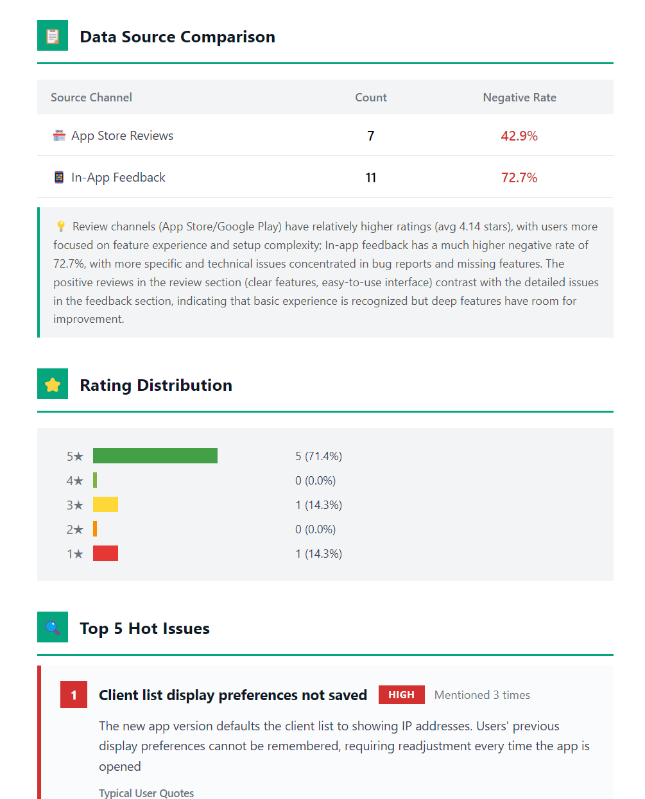

# App Feedback Monitoring Workflows

Automated app review monitoring and user feedback analysis system built with n8n.

## Overview

This project contains a complete feedback monitoring pipeline that automatically collects, analyzes, and categorizes user feedback from multiple sources. It uses AI to perform sentiment analysis, intent classification, and urgency detection, then consolidates everything into a Notion database for product team review.

## Architecture Overview



## Screenshots

| Workflow Overview | Weekly Report (Top) | Weekly Report (Detail) |
| --- | --- | --- |
|  |  |  |

## Features

- **Multi-source collection**: App Store reviews, Google Play reviews, and email feedback
- **AI-powered analysis**: Sentiment classification, intent detection, urgency flagging
- **Multi-language support**: 76+ languages for Google Play, 175+ countries for App Store
- **Automatic deduplication**: Prevents duplicate entries in Notion database
- **Priority alerting**: Negative reviews and urgent issues are flagged for immediate attention
- **Scheduled execution**: Runs automatically on configurable schedules

## Workflows

### 1. App Store Review Analysis (`app-store-review-analysis.json`)

Monitors and analyzes app reviews from both Google Play and App Store.

**Schedule**: Daily at 03:05 AM (UTC)

**Process**:
1. Fetch reviews from Google Play (via internal API) and App Store (RSS feed)
2. Filter reviews within a 14-day window
3. Perform AI sentiment analysis and categorization
4. Deduplicate against existing Notion records
5. Flag negative reviews (rating ≤ 2 stars) for alerting
6. Write analyzed reviews to Notion database

### 2. Email Feedback Analysis (`email-feedback-analysis.json`)

Processes and analyzes user feedback emails from Google Sheets.

**Schedule**: Daily at 05:00 AM (UTC)

**Process**:
1. Read feedback data from Google Sheets
2. Parse HTML email content to extract structured data
3. Group users and deduplicate feedback
4. Perform AI intent analysis and categorization
5. Flag critical issues based on urgency criteria
6. Write analyzed feedback to Notion database

### 3. Weekly Report Summary (`weekly-report-summary.json`)

Comprehensive weekly review analysis combining data from all sources.

**Schedule**: Daily at 03:05 AM (UTC)

**Process**:
1. Fetch reviews from Google Play and App Store
2. Apply 14-day rolling window filter
3. Perform multi-dimensional AI analysis (sentiment, intent, features)
4. Deduplicate with existing Notion records
5. Generate priority-based alerts
6. Write consolidated analysis to Notion database

## Prerequisites

### Required Services

| Service | Version/Requirement |
| --- | --- |
| n8n | v1.0.0 or higher |
| Notion | Account with API access |
| OpenAI compatible API | OpenAI, Groq, LM Studio, Ollama, or similar |
| Google Sheets | For email feedback workflow only |

### Required n8n Credentials

Create the following credentials in your n8n instance before importing:

| Credential | Description |
| --- | --- |
| Notion API | Your Notion integration token |
| OpenAI API | Your OpenAI or compatible API key |
| Google Sheets OAuth2 | Google account with Sheets access (email workflow only) |

## Setup Instructions

### Step 1: Clone or Download

```bash
git clone <repository-url>
cd n8n-app-feedback-monitoring
```

### Step 2: Configure Credentials in n8n

#### Notion API

1. Go to [Notion Integrations](https://www.notion.so/my-integrations)
2. Create a new integration and copy the API token
3. In n8n, create a new "Notion API" credential
4. Paste your API token

#### OpenAI / Compatible API

1. Obtain your API key from OpenAI or compatible provider
2. In n8n, create a new "OpenAI API" credential
3. Configure the base URL if using a compatible provider

#### Google Sheets (Email Feedback Workflow)

1. In n8n, create a new "Google Sheets OAuth2 API" credential
2. Complete the OAuth flow with your Google account

### Step 3: Create Notion Database

Create a new Notion database with the following properties:

#### Base Properties (All Workflows)

| Property | Type | Description |
| --- | --- | --- |
| Title | Title | Review/feedback title |
| Review ID | Rich Text | Unique review ID |
| Username | Rich Text | Reviewer username |
| Review Content | Rich Text | Original review content |
| Translated Content | Rich Text | AI translated content |
| Rating | Number | Star rating (1-5) |
| Review Date | Date | Review date |
| Sentiment Label | Select | Sentiment classification |
| Intent Label | Select | Intent category |
| Feature Category | Select | Feature category |
| Priority | Select | Priority level |
| Source | Select | Review source |
| Processing Status | Select | Processing status |
| Country | Rich Text | Country code |
| App Version | Select | App version |
| Country Type | Select | Country type |
| Review Language | Rich Text | Review language |

#### Email Feedback Additional Properties

| Property | Type | Description |
| --- | --- | --- |
| Original Feedback | Rich Text | Original feedback text |
| Translated Text | Rich Text | Translated feedback |
| Email Subject | Rich Text | Email subject |
| User Email | Rich Text | User email |
| User ID | Rich Text | User identifier |
| User Name | Rich Text | User name |
| Mobile OS | Select | Mobile OS |
| Phone Model | Rich Text | Phone model |
| Device Model | Rich Text | Device model |
| Hardware Version | Rich Text | Hardware version |
| Firmware Version | Rich Text | Firmware version |
| Message ID | Rich Text | Message ID |
| Feedback Category | Select | Feedback category |
| Feedback Type | Select | Feedback type |
| Sentiment | Select | Sentiment |
| Country | Rich Text | Country |
| Region | Rich Text | Region |
| Is Urgent | Select | Is urgent |
| Received Date | Date | Received date |
| Feature Classification | Select | Feature category |

### Step 4: Replace Placeholders

Search for and replace the following placeholders in the workflow JSON files:

| Placeholder | Replacement |
| --- | --- |
| `YOUR_API_KEY` | Your internal API key for Google Play reviews |
| `YOUR_API_ENDPOINT` | Your internal API endpoint URL |
| `YOUR_APPSTORE_APP_ID` | Your App Store app ID (e.g., `com.yourcompany.yourapp`) |
| `YOUR_NOTION_API_ID` | Your Notion API credential ID in n8n |
| `YOUR_NOTION_DATABASE_ID` | Your Notion database ID |
| `YOUR_OPENAI_API_ID` | Your OpenAI/compatible API credential ID in n8n |
| `YOUR_AI_MODEL_ID` | AI model ID (e.g., `gpt-4o`, `Qwen/Qwen3-8B`) |
| `YOUR_GOOGLE_SHEETS_API_ID` | Google Sheets credential ID in n8n |
| `YOUR_GOOGLE_DOC_ID` | Google Sheets document ID |
| `YOUR_WEBHOOK_ID_*` | Webhook IDs (any unique string) |
| `YOUR_VERSION_ID` | Workflow version ID |
| `YOUR_INSTANCE_ID` | n8n instance ID |
| `YOUR_WORKFLOW_ID` | Workflow ID |

### Step 5: Import Workflows

1. Open n8n
2. Click **Workflows** → **Import from JSON**
3. Paste the content of the desired workflow JSON file
4. Click **Import**
5. Open each workflow and select the appropriate credentials
6. Update the Notion database ID if necessary

### Step 6: Activate Workflows

1. Open each imported workflow
2. Click **Activate** to enable scheduled execution
3. For testing, click **Test workflow** to run manually

## AI Analysis Labels

### Sentiment Labels

| Label | Description |
| --- | --- |
| Positive | Clear praise or satisfaction |
| Negative | Complaints or dissatisfaction |
| Neutral | Factual statements or questions |
| Urgent | Strong negative emotions, critical issues |
| Frustrated | Frustration or confusion |

### Intent Labels

| Label | Description |
| --- | --- |
| Bug Report | User reports a bug or issue |
| Feature Request | User requests a new feature |
| Usability Issue | Problems with app usability |
| Customer Service | Requests for support |
| Newbie Question | Basic how-to questions |
| Positive Showcase | User shares positive experience |
| Pricing Issue | Concerns about pricing |
| Account Problem | Login or account issues |
| Performance Issue | Slow or unresponsive app |
| Competitor Comparison | User compares with competitors |

### Feature Categories

| Category | Description |
| --- | --- |
| WiFi Configuration | SSID, password, band, channel settings |
| Account/Login | Login, registration, password reset, 2FA |
| Connection/Loading | Controller connection, remote access, timeout |
| Voucher | Voucher creation and management |
| Device Management | Device adding/deleting, firmware upgrade |
| Dashboard/UI | Interface display, statistics |
| Notification | Push notifications, alert settings |
| Network Topology | Topology visualization |
| Client Management | Client list, speed limits |
| Settings | App preferences, language, theme |
| Other | Cannot be categorized |
| N/A | Not applicable |

### Priority Levels

| Level | Criteria |
| --- | --- |
| P0 - Critical | App crash, complete failure, security issues |
| P1 - High | Core features unavailable, urgent sentiment |
| P2 - Medium | Usability issues, performance problems |
| P3 - Low | Minor issues, feature requests |
| P4 - None | Positive feedback, no action needed |

## Project Structure

```
n8n-app-feedback-monitoring/
├── README.md
├── screenshots/
│   ├── workflow-overview.png
│   ├── weekly-report-sample_1.png
│   └── weekly-report-sample_2.png
├── app-store-review-analysis.json
├── email-feedback-analysis.json
└── weekly-report-summary.json
```

## Configuration Tips

### Adjusting Analysis Sensitivity

Edit the system prompt in each AI node to adjust:

- Temperature (`0.0-1.0`, lower = more consistent)
- Sentiment thresholds
- Urgency criteria
- Feature category definitions

### Customizing Schedules

Modify the **Schedule Trigger** node in each workflow:

- Default: Daily at 03:05 AM (App Store/Weekly) and 05:00 AM (Email)
- Use cron expressions for custom schedules

### Adding New Data Sources

1. Add a new trigger node (webhook, schedule, or polling)
2. Add HTTP Request node to fetch data
3. Add a **Merge** node to combine with existing data flow
4. Follow the existing transformation and analysis pipeline

## Troubleshooting

### Workflow Not Triggering

- Verify the workflow is **Active** (toggle in top-right)
- Check the schedule trigger configuration
- Ensure n8n is running and accessible

### AI Analysis Returns Empty Results

- Verify API credentials are valid
- Check the AI model supports JSON output mode
- Review the prompt for syntax errors

### Notion Write Fails

- Confirm the database is shared with your integration
- Verify all required properties exist in the database
- Check the Notion API credential has write permissions

### Deduplication Not Working

- Ensure the review ID field is populated correctly
- Verify the **Lookup** node is configured to check existing records
- Check the merge logic properly filters duplicates

## Security Notes

> **Important**: Follow these security best practices when deploying workflows.

- **Never commit real credentials** to version control
- All credentials are referenced by n8n credential IDs, not embedded
- Store sensitive values in n8n's credential manager
- Consider using environment variables for additional configuration
- Rotate API keys regularly

## License

MIT License - Feel free to modify and use for your projects.

## Contributing

Improvements welcome! Please ensure:

1. Remove all real credentials and API keys before submitting
2. Use descriptive placeholder names (e.g., `YOUR_API_KEY`)
3. Test the workflow before submitting
4. Update documentation for any new features
